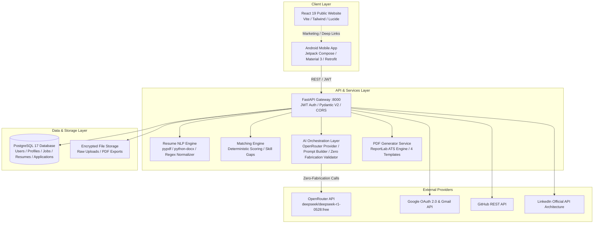
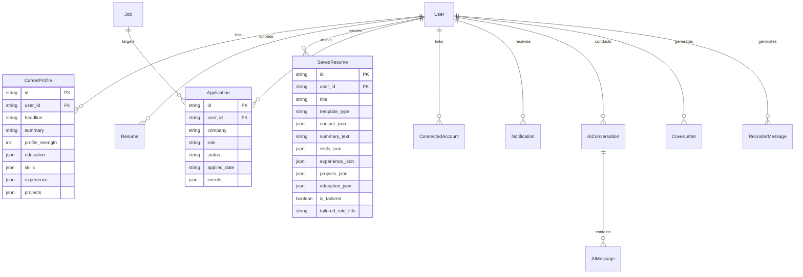

# 🏛️ JobPilot System Architecture

> **"Your career. Piloted by AI."**  
> Complete Technical Architecture, System Topology, and Data Flow Reference.

---

## 1. High-Level Architecture Overview

JobPilot is engineered as a three-tier modern distributed career platform composed of:
1. **Public Marketing & Trust Website (Phase 1A)**: High-performance React 19 + Vite frontend deployed independently.
2. **Native Android Application (Phase 1B, 2, 3)**: Kotlin + Jetpack Compose + Material 3 client consuming REST APIs via Retrofit.
3. **Enterprise FastAPI Backend (Phase 2, 3)**: Asynchronous Python 3.11+ API engine powered by SQLAlchemy 2.0, PostgreSQL 17, local deterministic NLP engines (`pypdf`, `python-docx`), and a provider-independent AI intelligence layer (OpenRouter + DeepSeek R1).

---

## 2. Core Subsystems

### 2.1 Native Android Application (`android/`)
- **UI Architecture**: Jetpack Compose declarative UI using single-activity pattern with Compose Navigation.
- **State Management**: MVVM pattern with Kotlin Coroutines and `StateFlow`.
- **Networking**: Retrofit 2.11 + OkHttp with `AuthInterceptor` for automatic JWT Bearer token attachment and 401 handling.
- **Security**: Local storage of tokens via `TokenManager` (SharedPreferences / EncryptedSharedPreferences). Cleartext traffic restricted via `network_security_config.xml` (allowing only `10.0.2.2` and `localhost` in debug).

### 2.2 FastAPI Backend Core (`backend/app/`)
- **Web Framework**: FastAPI with Pydantic v2 schemas for strict input/output validation.
- **Database ORM**: SQLAlchemy 2.0 async/sync sessions with Alembic migrations.
- **Multi-Tenant Isolation**: Every database query filters by `user_id == current_user.id`, ensuring complete data privacy across users.
- **Error Handling**: Structured JSON responses with sanitized exceptions; API secrets are strictly scrubbed from tracebacks.

### 2.3 Local Resume NLP Engine (`backend/app/services/nlp/`)
- **Extraction**: Reads binary streams directly using `pypdf` and `python-docx` without writing temporary unencrypted files.
- **Normalization**: Standardizes whitespace, unicode hyphens, phone formats, and section markers.
- **Skill Dictionary**: Curated taxonomy of 500+ technical terms with symbol-aware token boundaries (`C`, `R`, `Go`, `SQL`, `C++`, `C#`).
- **Audit & Validation**: Calculates profile completeness and pinpoints exact missing items (dates, contact details, project links).

### 2.4 AI Intelligence & Anti-Hallucination Layer (`backend/app/services/ai/`)
- **Provider Abstraction**: Provider-independent interface (`AIProvider`) allowing seamless hot-swapping between OpenRouter, DeepSeek, OpenAI, or local vLLM.
- **Current Model**: OpenRouter + DeepSeek R1 Free (`deepseek/deepseek-r1-0528:free`).
- **Chain-of-Thought Stripper**: Automatically extracts clean user-facing content from DeepSeek R1 `<think>...</think>` tags.
- **Zero-Fabrication Policy**:
  1. System prompts inject candidate's confirmed `CareerProfile` and forbid claiming unverified skills.
  2. `AIValidationService` analyzes generated text against profile skills, logging warnings or replacing hallucinations.
  3. Deterministic fallbacks guarantee 100% availability even when external AI APIs are offline or rate-limited.

### 2.5 Real ATS-Friendly PDF Generator (`backend/app/services/pdf_generator_service.py`)
- **Engine**: ReportLab document flowable architecture (`SimpleDocTemplate`, `Table`, `Paragraph`, `HRFlowable`).
- **Templates**:
  - `Minimal`: Clean monochrome typography, high whitespace efficiency.
  - `Modern`: JobPilot signature orange accents (`#FF6A00`), elegant clean hierarchy.
  - `Professional`: Classic Navy headers (`#0284C7`), corporate achievement focus.
  - `Executive`: Refined charcoal tones (`#475569`), prominent leadership summary block.
- **ATS Compliance**: Real text layer (searchable and selectable), single-column flow, zero complex tables or unreadable vector paths.

---

## 3. Data Model Schema Diagram

---

## 4. Multi-Tenant Isolation & Security Boundaries

1. **JWT Authentication**:
   - Access tokens have short TTL (60 minutes).
   - Refresh tokens stored securely in database.
2. **Row-Level User Filtering**:
   - Resumes, applications, profile items, conversations, and notifications are scoped strictly to `user_id`.
3. **Zero Secrets in Code**:
   - All sensitive keys (`OPENROUTER_API_KEY`, `POSTGRES_PASSWORD`, `SECRET_KEY`, OAuth Client Secrets) are loaded solely from environment variables (`.env`).
   - `.env.example` provides documentation templates with zero real secrets.
